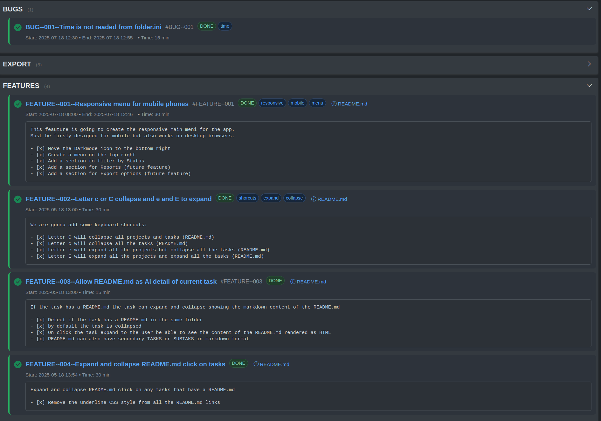

<!-- filepath: /var/www/html/php-simpletasks/README.md -->
# PHP SimpleTasks: Filesystem-Based Project & Task Visualizer

**PHP SimpleTasks** is a lightweight, directory-driven web application that dynamically visualizes your project and task structure. It transforms your filesystem hierarchies into an intuitive, interactive interface, leveraging Bootstrap for a clean and responsive experience.

## Overview

At its core, PHP SimpleTasks scans a designated root directory:
-   First-level subdirectories are interpreted as **Projects**.
-   Second-level subdirectories (within each project) are recognized as **Tasks**.

The application then renders this structure in a user-friendly web view, providing an immediate overview of your ongoing work, organized by project. Task metadata, such as status, ID, start/end times, duration, and tags, can be defined in `folder.ini` files within each task directory, offering a richer, GitHub-issues-like experience.




## Key Features

-   **Automatic Discovery:** Dynamically lists projects and tasks based on your directory structure.
-   **Rich Task Metadata:** Parses `folder.ini` files within task directories for details like:
    -   Status (e.g., TODO, WIP, DONE)
    -   Task ID
    -   Start and End Times
    -   Duration (manual or calculated)
    -   Descriptive Tags
-   **GitHub-Inspired UI:** Tasks are presented in a familiar, issue-tracker style, with status-based visual cues and icons.
-   **Collapsible Sections:**
    -   Project listings can be collapsed to save space, with their state persisted in `localStorage`.
    -   Task-specific `README.md` files can be embedded and expanded/collapsed directly within the task view.
-   **Theme Customization:**
    -   Light and Dark mode support, with automatic theme detection based on system preference or time of day.
    -   Theme preference is saved in `localStorage`.
-   **Filtering & Navigation:**
    -   Top-right menu allows filtering tasks by status, with the filter state persisted.
    -   **Keyboard Shortcuts** for efficient navigation:
        -   `c`: Collapse all task READMEs.
        -   `C`: Collapse all projects and all task READMEs.
        -   `e`: Expand all projects and collapse all task READMEs.
        -   `E`: Expand all projects and all task READMEs.
-   **Responsive Design:** Built with Bootstrap for optimal viewing on desktops, tablets, and mobile devices.
-   **Easy Setup:** No database required; runs directly from your filesystem via a web server.
-   **Exclusion Rules:** Ignores hidden directories (e.g., `.git`) and common development folders (e.g., `vendor`, `tests`).

## Technology Stack

-   **Backend:** PHP (7.4+)
-   **Frontend:** HTML, CSS, JavaScript, Bootstrap 5

## Installation

1.  **Clone the Repository:**
    ```bash
    git clone https://github.com/davidjimenez75/php-simpletasks.git /var/www/html/php-simpletasks
    # Or your preferred web server directory
    ```

2.  **Permissions:**
    Ensure your web server (e.g., Apache, Nginx) has read permissions for the project directory and its subdirectories.

3.  **Access:**
    Navigate to the application's URL in your web browser (e.g., `http://localhost/php-simpletasks`).

## Usage

1.  **Organize Your Projects:**
    -   Create a main directory for PHP SimpleTasks (e.g., `/var/www/html/php-simpletasks`).
    -   Inside this directory, create subdirectories for each of your **Projects**.
    -   Within each project directory, create further subdirectories for each **Task**.

2.  **Define Task Metadata (Optional but Recommended):**
    -   Inside each task directory, you can create a `folder.ini` file to specify metadata. Example:
        ```ini
        ; /var/www/html/php-simpletasks/MyProject/MyTask/folder.ini
        id=PROJ-123
        status=WIP
        start=2025-05-10--100000
        end=2025-05-12--180000
        duration_minutes=120 
        tags=frontend, critical, refactor
        ```
    -   Supported fields: `id`, `status`, `start` (YYYY-MM-DD--HHMMSS), `end` (YYYY-MM-DD--HHMMSS), `duration_minutes`, `tags` (comma-separated).

3.  **Add Task Details (Optional):**
    -   Create a `README.md` file inside any task directory to provide detailed descriptions, notes, or checklists. This content will be viewable directly in the UI.

4.  **Interact with the Interface:**
    -   Use the project toggles to expand or collapse task lists.
    -   Use the top-right menu to filter tasks by their status.
    -   Toggle between light and dark themes using the button at the bottom-right.
    -   Utilize the keyboard shortcuts (`c`, `C`, `e`, `E`) for quick visibility changes.

## Contributing

Contributions are highly welcome! If you have suggestions for improvements or new features, please feel free to:
1.  Fork the repository.
2.  Create a new branch for your feature or bug fix.
3.  Commit your changes.
4.  Push to your branch and submit a Pull Request.

Please ensure your code adheres to the existing style and that any new features are documented.

## License

This project is licensed under the MIT License. See the `LICENSE` file (if present) or refer to the MIT License terms for details.